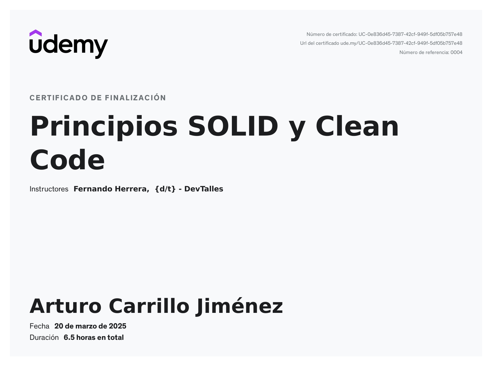

# Proyecto para practicar

Este es un proyecto de Vanilla TypeScript en Vite, para trabajar los ejercicios del curso sobre Principios SOLID y CleanCode.

Clonar o descargar el proyecto y luego:

```
yarn install
ó
npm install
```

Para ejecutar el proyecto, simplemente ejecuten

```
yarn dev
ó
npm run dev
```


